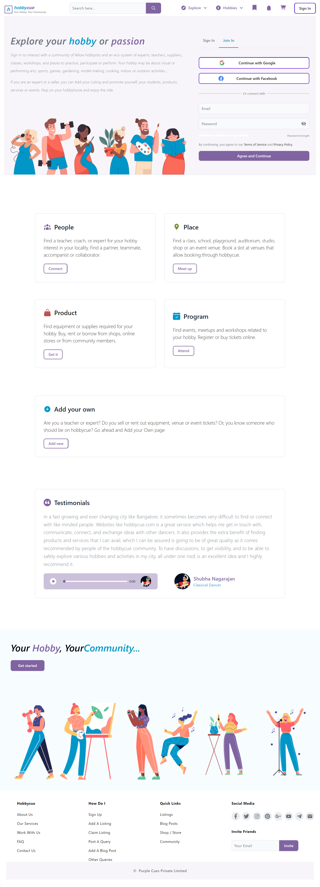
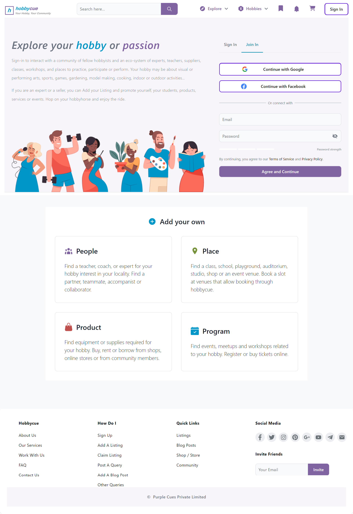

# Assignment by Across The Globe (ATG)

## Table of Contents
- [Project Overview](#project-overview)
- [Features](#features)
- [Technologies Used](#technologies-used)
- [Installation](#installation)
- [Folder Structure](#folder-structure)
- [Demo](#demo)

## Project Overview
This application is built with modern web technologies to ensure a responsive and user-friendly experience.

## Features
- **Responsive Design**: The application is mobile-friendly and has a clean design.

## Technologies Used
- **Frontend**: React, React-Router-DOM, Vite, JavaScript, Tailwind CSS, Bootstap, and Flowbite
- **Hosting**: Netlify

## Installation

1. **Clone the repository**:
    ```bash
    git clone https://github.com/Chandan8018/BanaoReactJS.git

    ```

2. **Frontend Setup**:
    ```bash
    npm install
    ```

## Usage
1. **Start the backend server**:
    ```bash
    npm run dev
    ```

2. **Start the frontend server**:
    ```bash
    cd frontend
    npm run dev
    ```


## Folder Structure

```sh
  
frontend
├── public
├── src
|   ├── components
│   |   ├── FooterComp.jsx
│   |   └──  Header.jsx 
|   ├── pages
│   |   ├── Home.jsx
│   |   ├── AddOwn.jsx
│   |   ├── JoinIn.jsx
│   |   └── SignIn.jsx
|   ├── App.jsx
|   ├── main.jsx
|   └── index.css
├── .eslintrc.js
├── .gitignore
├── index.html
├── package-lock.json
├── README.md
├── package.json
├── postcss.config.js
├── tailwind.config.js
└── vite.config.js
```
## Demo


---

---

---

---


